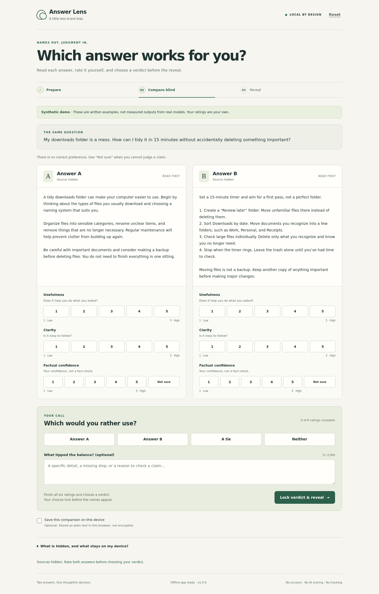

# Answer Lens

**Judge the answer. Not the name.**

A small English web tool for comparing two AI answers with their source names hidden until after your own verdict. Paste a question and two answers, read the shuffled A/B pair, rate it yourself, then reveal the names and keep a complete result JSON.

**[Try Answer Lens in your browser](https://donizetiferr.github.io/answer-lens/)** · MIT licensed · No account or API key required.

[Watch the six-second preview](media/answer-lens-preview.mp4). It combines real app screenshots with labelled synthetic examples and English captions, rendered and verified with DoniStudio. It is a quick preview, not a model benchmark.



[Desktop result](media/review-v2/desktop-result.png) · [Mobile ratings](media/review-v2/mobile-ratings.png) · [Mobile result](media/review-v2/mobile-result.png)

These are actual browser captures with synthetic example answers and scripted test ratings, not a human preference study.

## Run it locally

Node **22 or newer** is required for the included local server and tests. The browser app itself is vanilla HTML, CSS and JavaScript, with **zero runtime packages** and no build step.

```sh
git clone https://github.com/donizetiferr/answer-lens.git
cd answer-lens
node scripts/serve.mjs
```

Open `http://127.0.0.1:4173` in a current browser. Using the local app requires no account, API key, payment, or internet connection. All app assets are local. `PORT=4180 node scripts/serve.mjs` selects a different local port.

The server binds only to loopback and serves a fixed app-file allowlist, not the whole repository. Stop it with Ctrl+C. Do not double-click `index.html` as a `file://` document: browser modules and service workers need a local HTTP origin or HTTPS.

After the footer says **Offline app ready**, the service worker has cached the app shell. The comparison also works after an offline reload. Browser storage clearing, private-window closure, a different origin/port, or browser cache eviction may remove that capability. Browser tests exercise an actual offline reload, not just an “offline” label.

## Try the complete demo

Choose **Try the synthetic demo**, then **Hide names & compare**. Both demo answers are original synthetic examples about tidying a downloads folder. They are not measured outputs from named models. The synthetic label remains with the comparison, including its export; reset before starting an unrelated real comparison.

For your own comparison, enter the same question for both answers, paste both answer texts, and optionally enter their source names. Those names are user-supplied, not authenticated. When you start, the app records a random seed and A/B assignment, removes the source inputs from the rendered page, and shows only the blind pair.

Rate **usefulness**, **clarity**, and **factual confidence** for each answer. Use 1–5 for the first two; factual confidence also offers **Not sure**. Confidence is your feeling about the claims, not a fact-check. Nothing computes factual accuracy or averages your ratings into an automatic winner.

Choose **Answer A**, **Answer B**, **A tie**, or **Neither**. All six ratings and a verdict are required before **Lock verdict & reveal**. Your verdict and ratings are locked before origins appear. To make another comparison, reset; there is no hidden reroll or post-reveal score editing.

**Export result JSON** downloads the full result. On the starting screen, **Open a saved JSON** reads an exported result locally. Imported results are already revealed, explicitly labelled that way, and never silently turn on saving. Generate a deterministic sample with `node scripts/demo.mjs`. Its seed, timestamps and ratings are explicitly illustrative. Browser tests separately check a real download and local import.

## Privacy and honest boundaries

The app makes no model calls, sends no answer text, has no analytics, trackers, external scripts, external fonts, signup, or paid service. Runtime requests are local GETs for the app shell. There is no backend that accepts uploads. Text is rendered as text, not HTML or Markdown.

Saving is **off by default**: your working comparison stays in that tab. Opting in saves one comparison as plain JSON under `answer-lens.session.v1` in this origin's `localStorage`. It is **not encrypted**. Turning saving off deletes that key while keeping the current tab usable. Reset removes this app's question, answers, sources, ratings, verdict, note and saved comparison, but not unrelated keys, the offline app cache, or files you already downloaded. Other opted-in tabs respond to updates and reset; simultaneous editing is last-write-wins, not collaborative merging.

Browser tools, extensions, another person with access to the same browser, and anyone you give an export to may read the full data. Storage blocking or quota failures produce an explicit warning rather than a false saving/deletion claim. This is not a tool for protecting secrets from someone who controls your device.

Blinding is **at the interface level**. You pasted the answers and may recognize their style or content; answers may name their own model. The app does not silently rewrite or anonymize them. Ask someone else to prepare the pair for less familiarity, and remove self-identifying phrases when practical. Source fields and the recorded mapping are hidden in the comparison UI, not secured against local inspection.

One preference on one question does **not** establish model superiority, factual correctness, or a general ranking. JSON records are editable files, not signed evidence of an experiment.

## Export format

The self-contained `answer-lens-result/1` JSON includes the app version, fixed interpretation caveats, and a `comparison` containing the full question, original input order with both texts and source names, ratings by blind label, verdict, note, synthetic-demo flag, assignment time and verdict-lock time.

`comparison.randomization` records `algorithm`, an unsigned 32-bit `seed`, `order`, and `assignedAt`. For example, `order: [1, 0]` means **A came from the second input and B from the first**. Production seeds come from `crypto.getRandomValues`; the versioned `mulberry32-first-draw-v1` function reproduces the assignment. Tests use fixed seed vectors; the UI has no seed override. The seed and mapping are disclosed only after reveal in the UI and export. They are not a cryptographic commitment.

Import validates the schema, phase, ratings, sizes and seed/order consistency. It canonicalizes known fields and forces persistence consent off. It cannot establish the authenticity of user-supplied source names or prove that an edited JSON was originally produced by the app.

Limits: question 8,000 JavaScript string units; each answer 40,000; each source 120; note 2,000; imported file up to 600,000 bytes. Input limits avoid unbounded local rendering/storage work, not all possible resource exhaustion.

## Tests

The isolated gate suite and deterministic Node demo require no installation, network, browser or child processes:

```sh
node scripts/run-gates.mjs
node scripts/demo.mjs > result.json
```

The gate runner imports the three `test_files` in `buildsignal-gates.json` into the current process. Each test file is also directly runnable with `node`. The demo writes a complete JSON result to standard output and uses no clock or random input.

Server and actual-browser checks are separate from those isolated gates. The only development dependency is pinned Playwright; it is not shipped into the app. The test runner is Node's built-in `node:test`.

```sh
node --test tests/server.test.mjs
PLAYWRIGHT_SKIP_BROWSER_DOWNLOAD=1 npm ci --ignore-scripts
CHROME_PATH=/usr/bin/google-chrome npm run test:browser
# All three suites:
npm run test:all
```

Set `CHROME_PATH` to an installed Chrome/Chromium executable when it differs. No browser binary is bundled or automatically downloaded by the commands above. Browser tests create isolated contexts and a temporary loopback server and close both in teardown. They create synthetic-only evidence and screenshots in this repository.

`tests/core.test.mjs` tests input validation, seeded ordering, blind projections, locked verdicts, reset state, safe text preservation and export/import. `tests/storage.test.mjs` tests consent, restoration, corrupt/blocked storage and key-scoped deletion. `tests/server.test.mjs` tests safe headers, the app-file allowlist, rejected uploads and local-only assets. `tests/browser.test.mjs` exercises the real app, DOM/accessibility-tree source hiding, hostile-looking text, actual downloads/import, keyboard interactions, 390px mobile layout, 320px overflow, multiple tabs, and offline reload.

Recorded results and their limits are in [`docs/evidence.md`](docs/evidence.md). Machine-readable entry points are in [`buildsignal-gates.json`](buildsignal-gates.json). Passing these checks is not a full accessibility, security, cross-browser, or scientific evaluation certification.

## Structure and maintenance

`index.html`, `styles.css`, `icon.svg`, `sw.js`, and `src/` are the complete runtime. `src/core.js` is pure comparison logic; `src/storage.js` handles only this app's local key; `src/app.js` renders safe text nodes and handles the workflow. `src/demo.js` holds the synthetic examples. The service worker caches only the fixed app-file list; increment its cache version when changing released assets.

`scripts/serve.mjs` is the dependency-free local development server. Media preparation and validation scripts are separate from runtime. They do not run on app startup, do not add a media service to the product, and do not modify DoniStudio policies.

## Prior art and license

Blind pairwise comparison is prior art, notably **Chatbot Arena**: Chiang et al., *Chatbot Arena: An Open Platform for Evaluating LLMs by Human Preference* (2024), [arXiv:2403.04132](https://arxiv.org/abs/2403.04132). Answer Lens does not claim to invent it and does not reuse Arena's code, assets, model outputs or branding.

The differentiation is deliberately narrower: a local, paste-first personal worksheet; human ratings with explicit uncertainty; a verdict locked before reveal; recorded shuffle; and a portable result rather than a leaderboard. See [`docs/differentiation.md`](docs/differentiation.md).

Copyright © 2026 Donizeti Ferreira. [MIT License](LICENSE).
