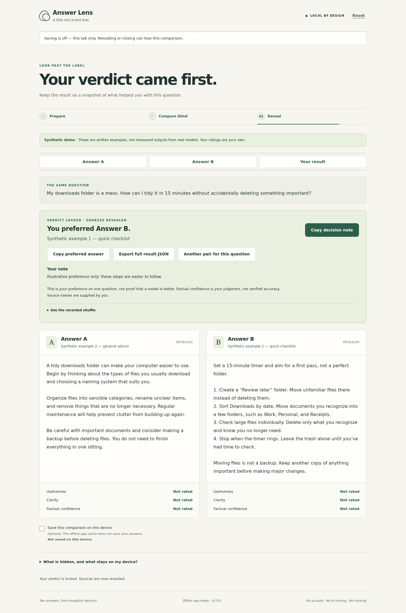

# Answer Lens

**Judge the answer. Not the name. Then keep something useful.**

A small, local-first English tool for comparing two AI answers. Bring one question and two answers, read the shuffled A/B pair with source names hidden, make your own decision, then reveal the origins. No model calls, automatic accuracy score, account, signup or tracking.

## Version 2.0

Version **2.0** is released on `main` after three additional review rounds and independent verification. Use the [live app](https://donizetiferr.github.io/answer-lens/) or inspect the [MIT source](https://github.com/donizetiferr/answer-lens). The reviewed runtime commit is `1f035bfdc1f030f80f7e4e46873f7cb47fcc38d5`.



[Reading and deciding](docs/design_refs/answer-lens-evolution/captures/evolution-desktop-reading.png) · [Mobile result](docs/design_refs/answer-lens-evolution/captures/evolution-mobile-result.png) · [Long answers on mobile](docs/design_refs/answer-lens-evolution/captures/evolution-mobile-390-long.png) · [Copy-permission fallback](docs/design_refs/answer-lens-evolution/captures/evolution-copy-fallback.png)

These are real browser captures with synthetic examples and scripted test decisions, not a human preference study. The [screen plan, journeys and capture manifests](docs/design_refs/answer-lens-evolution/DESIGN.md) distinguish the v1 baseline from the new implementation. The [current 7.5-second preview](media/answer-lens-final-preview.mp4) was captured and rendered after final product review; earlier previews remain as historical artifacts.

## Run locally

The runtime is vanilla HTML, CSS and browser JavaScript: **no runtime dependency and no build step**. Node 22 or newer runs the included loopback-only server and tests.

```sh
git clone https://github.com/donizetiferr/answer-lens.git
cd answer-lens
node scripts/serve.mjs
```

Open `http://127.0.0.1:4173`. Use `PORT=4180 node scripts/serve.mjs` for a different local port; stop with Ctrl+C. The server serves only a fixed app-file allowlist, not the repository. Do not double-click `index.html`: browser modules need a local HTTP origin or HTTPS.

After **Offline app ready**, the app shell is cached for later offline reloads on the same origin. This is separate from saving your comparison. A different browser/origin/port, browser eviction, or clearing site data can remove stored data or offline availability.

## Compare without filling out a questionnaire

Choose **Try the synthetic demo** for a complete example. Its answers are original synthetic teaching material, not measured outputs from real models. The synthetic notice stays with the result and copied/exported material.

For your own pair, enter the same question, both full answers, and optional source names. Remove self-identifying phrases when practical. Source names are user-supplied, not authenticated.

**Hide names & compare** records a random seed and A/B assignment, removes the source fields from the rendered page, and shows the full answers. Use **Answer A**, **Answer B** and **Your decision** to move around; the answer headers remain identifiable while reading. Text is not truncated, summarized or interpreted as HTML/Markdown.

Your **verdict is required**: prefer A, prefer B, call a tie, or choose neither. A missing verdict is explained beside the choices and keyboard focus returns there. A reason is optional.

**Add detailed ratings** is optional. Usefulness, clarity and factual confidence can each be left unrated. Factual confidence also allows **Not sure**. An omitted rating means **Not rated**—not zero, average, neutral or uncertain. Collapsing the section preserves selected ratings; **Clear optional ratings** removes only those ratings before reveal.

**Lock verdict & reveal** locks your verdict, reason and any supplied ratings before showing origins. There is no automatic winner, hidden reroll or editing of a revealed result.

## Keep the decision and try another pair

**Copy decision note** produces readable plain text containing the question, your verdict and reason, the revealed source mapping, supplied/omitted ratings, lock time, synthetic status and a short interpretation caveat. It does not silently include the full answer texts.

**Copy preferred answer** is available only for A or B, never for a tie or neither. It copies the complete selected answer. Synthetic demo answers receive an explicit synthetic prefix. Clipboard access happens only after your click. When permission is denied or the API is absent, the app exposes a labelled, selectable plain-text fallback; no remote service is used.

**Export full result JSON** remains the complete portable record, including both answers and the recorded shuffle. **Open a saved JSON** reads locally, opens an already-revealed result and never silently enables saving. Both genuine v1 exports and v2 results with no, partial or full ratings are accepted under their respective contracts.

**Another pair for this question** asks for confirmation before replacing the result. Copy or export first. Cancelling changes nothing. Confirming retains **only the question**: no answers, origins, ratings, reason, verdict, demo flag, saving consent, timestamps or assignment carry over. A fresh assignment is recorded when the next pair begins. This is a new personal decision, not proof that a revised prompt or model is generally better.

## Saving, privacy and version safety

Saving is **off by default**. A persistent status above the app and feedback beside the saving control distinguish tab-only, saving, saved, failed, protected-format and other-tab states. A normal workflow message does not erase a failed-save warning. A checked box alone is not a successful-save receipt.

Opting in stores one v2 comparison as unencrypted JSON under `answer-lens.session.v2` in this origin's `localStorage`. Cooperating v2 tabs serialize writes with a browser Web Lock and compare the exact saved snapshot before changing it. Without Web Lock support, the app stays usable in the tab but refuses to claim safe device saving; copy or export instead.

An update or reset in another tab **does not overwrite this tab's draft, selection or focus**. It turns this tab's saving off and shows a persistent notice. Saving this tab instead requires explicit confirmation. A stale confirmation cannot overwrite a saved copy that changed again. This is conflict detection, not collaborative merging or protection from other code controlling the origin.

Old v1 tabs use `answer-lens.session.v1`. V2 never writes or deletes that key. **Open older saved comparison** explicitly copies a valid older record into the current tab, with saving off; the original remains untouched. A v1 revealed record still needs the six ratings required by its old contract. V2 does not manufacture missing v1 data. Unknown/newer/malformed saved records are protected rather than auto-deleted or overwritten. This separation matters because URL paths on one origin share local storage.

Turning saving off or Reset removes only this tab's current, supported v2 saved copy when deletion succeeds. A newer copy from another tab or an unsupported record is preserved. Reset does not empty other open tabs, remove older v1 data, clear the clipboard, delete downloaded files, or delete unrelated keys and caches. Close/reset each tab separately and use browser storage controls when you need to remove older or unreadable copies. Failed deletion is reported, not represented as success.

Unsaved work requests a browser leave/reload warning as a best effort. Browsers, especially on mobile, need not display it. Do not rely on that warning instead of the save status or an export.

No question or answer is uploaded by the app. Runtime assets are local/same-origin GETs, with no analytics, external scripts/fonts, automatic link previews, paid API or answer-submission endpoint. The public hosting service still serves the initial app request; local-first does not mean that visiting a hosted page makes no network request. Text and exports can be read by extensions, other code with access to the origin, the device owner, or anyone receiving your clipboard/export. This is not secret storage.

## Honest limits and format

Blinding is **interface-level**, not a secure double-blind experiment. You may recognize an answer you pasted; an answer can identify its source. The app does not rewrite that content to hide clues. Someone with browser tools can inspect local state.

A preference on one question is not a model ranking. Factual confidence is the person's judgment, never verified accuracy. Source names and local JSON records are editable and unauthenticated.

V2 exports use `answer-lens-result/2`, `assessment: human-self-report`, and comparison `version: 2`. They include the full question and original inputs, optional ratings by blind label, verdict/reason, synthetic flag, assignment and lock times, and caveats. Imports canonicalize supported fields and force saving consent off. V1 imports upgrade explicitly to v2 on export; they are not byte-identical v1 re-exports.

The recorded `mulberry32-first-draw-v1` seed/order algorithm is unchanged. Production seeds come from `crypto.getRandomValues`; the UI has no seed control. For example, `order: [1, 0]` means A came from the second input. The seed is disclosed after reveal in the UI/export, not a cryptographic commitment.

Limits remain: question 8,000 JavaScript string units; each answer 40,000; origin 120; reason 2,000; imported file 600,000 bytes. Long text still requires reading and local rendering work.

## Current navigable catalog prototype

Watch the [current 7.5-second preview](https://donizetiferr.github.io/answer-lens/media/answer-lens-final-preview.mp4): choose with optional ratings, copy a useful decision note, then keep your question for another pair. It uses real app screens and labelled synthetic examples, captured after final review. [Media provenance](media/answer-lens-final-preview.json).

The existing [Answer Lens collection](docs/design_refs/answer-lens/comparison.html) now runs this 2.0 application, not the old pilot. Its desktop journey declares 1440×1000; the [mobile entry](docs/design_refs/answer-lens/mobile.html) declares 390×844. The collection folder, comparison screen ID, journey ID and existing entry links remain stable.

```sh
node scripts/sync-prototype.mjs --check
node scripts/serve-prototype.mjs
```

Open `http://127.0.0.1:4181/docs/design_refs/answer-lens/comparison.html` while that loopback-only server runs. Both entries support the actual local workflow. The preview has separate v2/v1 storage keys, a separate Web Lock and a scoped cache; it does not open the main application's saved comparison.

After intentional runtime changes, `node scripts/sync-prototype.mjs --write` refreshes this same collection. The read-only check fails on drift and is included in the isolated Node gates. [Design documentation](docs/DESIGN.md) explains the exact adaptations; [round-3 evidence](docs/prototype-evidence.md) records full browser journeys and same-origin isolation. Earlier images and video remain unchanged; no new video or deployment is part of this round.

## Tests and evidence

The pure gates and deterministic Node demo need **no installation, network, browser, server or child processes**:

```sh
node scripts/run-gates.mjs
node scripts/demo.mjs > result.json
```

Each `test_file` in `buildsignal-gates.json` is directly runnable with Node; the gate runner imports them into its own process. `scripts/demo.mjs` is a deterministic executable Node program, not HTML. Its fixed seed, times and test ratings are illustrative.

Actual UI/server checks are separate. Playwright is pinned as a development-only dependency, and no browser binary is bundled:

```sh
node --test tests/server.test.mjs
PLAYWRIGHT_SKIP_BROWSER_DOWNLOAD=1 npm ci --ignore-scripts
CHROME_PATH=/usr/bin/google-chrome npm run test:browser
# All isolated, server and browser suites:
npm run test:all
```

Browser tests use isolated contexts and their own temporary loopback servers with teardown. They write synthetic-only captures and local receipts, not user data. Frozen v1 core/storage fixtures come from the prior commit and exercise real old validation/deletion behavior alongside v2; no compatibility repository is modified.

See [evolution evidence](docs/evolution-evidence.md), [historical build/media evidence](docs/evidence.md) and [screen references](docs/design_refs/answer-lens-evolution/DESIGN.md). Reported keyboard/DOM/accessibility-tree checks are not a fabricated screen-reader, full accessibility or cross-browser certification.

## Prior art and license

Blind pairwise comparison is prior art, notably Chiang et al., *Chatbot Arena: An Open Platform for Evaluating LLMs by Human Preference* (2024), [arXiv:2403.04132](https://arxiv.org/abs/2403.04132). Answer Lens does not reuse Arena's code, branding, assets or model answers, and does not claim to invent the method.

The narrower differentiation is a paste-first local worksheet: full-answer reading, an explicit personal verdict before source reveal, optional rather than compulsory scoring, readable takeaways, recorded assignment, and a safe next pair for the same question—not a leaderboard. See [differentiation](docs/differentiation.md).

Copyright © 2026 Donizeti Ferreira. [MIT License](LICENSE).
